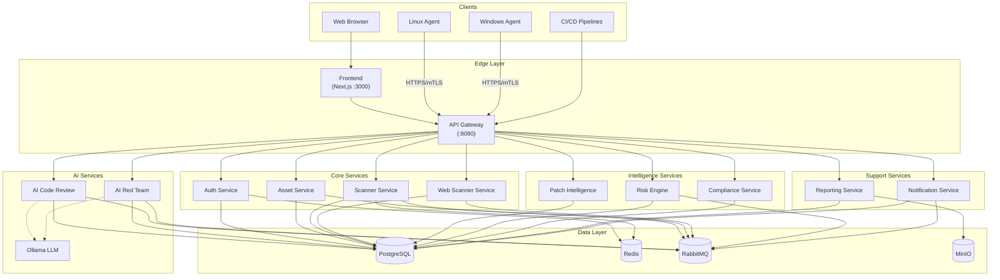
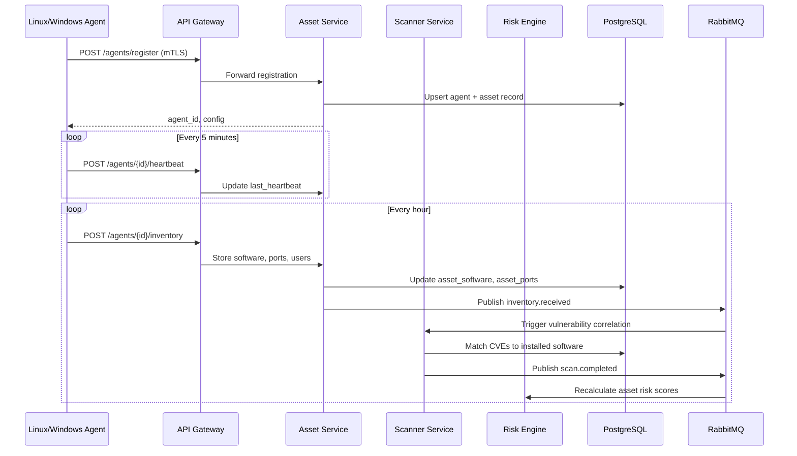
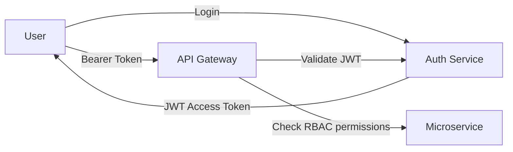

# VulnShield Platform Architecture

VulnShield is a cloud-native vulnerability management platform built as microservices. It provides asset discovery, vulnerability scanning, AI-assisted code review, red team simulation, patch intelligence, risk scoring, compliance mapping, and reporting.

## High-Level Architecture

## Service Responsibilities

| Service | Port (internal) | Purpose |
|---------|-----------------|---------|
| **API Gateway** | 8080 | Single entry point, JWT validation, request routing, rate limiting |
| **Auth Service** | 8001 | User authentication, RBAC, JWT issuance, LDAP/MFA support |
| **Asset Service** | 8002 | Asset inventory, agent registration, software/port tracking |
| **Scanner Service** | 8003 | Network and agent-based vulnerability scanning orchestration |
| **Web Scanner Service** | 8004 | OWASP web application scanning (SQLi, XSS, CSRF, etc.) |
| **AI Code Review** | 8005 | LLM-powered static analysis of source code repositories |
| **AI Red Team** | 8006 | AI-driven attack simulation with MITRE ATT&CK mapping |
| **Patch Intelligence** | 8007 | CVE-to-patch mapping, vendor advisories, EOL tracking |
| **Risk Engine** | 8008 | Composite risk scoring (CVSS, EPSS, KEV, business context) |
| **Reporting Service** | 8009 | PDF/Excel/CSV report generation, stored in MinIO |
| **Compliance Service** | 8010 | CIS, NIST, ISO 27001, PCI-DSS framework assessments |
| **Notification Service** | 8011 | Email, Slack, Teams, webhook alerting |
| **Frontend** | 3000 | Next.js dashboard for SOC analysts and administrators |

## Data Flow: Agent Inventory

## Messaging Architecture

RabbitMQ handles asynchronous event processing between services:

| Exchange | Routing Key | Consumer |
|----------|-------------|----------|
| `vulnshield.events` | `inventory.received` | Scanner Service |
| `vulnshield.events` | `scan.completed` | Risk Engine, Notification Service |
| `vulnshield.events` | `vulnerability.critical` | Notification Service |
| `vulnshield.events` | `report.generated` | Notification Service |

## Authentication & Authorization

Roles defined in the database: `administrator`, `security_manager`, `soc_analyst`, `developer`, `auditor`, `read_only`. Permissions are stored as JSON arrays on the `roles` table and enforced at the API Gateway layer.

## Agent Communication

Agents communicate over HTTPS with optional mutual TLS:

- **Registration**: `POST /api/v1/agents/register`
- **Heartbeat**: `POST /api/v1/agents/{agent_id}/heartbeat`
- **Inventory**: `POST /api/v1/agents/{agent_id}/inventory`

Certificate paths (Linux): `/etc/vulnshield/certs/{client.crt, client.key, ca.crt}`

## Technology Stack

| Layer | Technology |
|-------|-----------|
| Frontend | Next.js 14, React, TypeScript, Tailwind CSS |
| API Gateway | Python, FastAPI |
| Microservices | Python 3.12, FastAPI, SQLAlchemy (async) |
| Database | PostgreSQL 16 |
| Cache | Redis 7 |
| Message Queue | RabbitMQ 3.13 |
| Object Storage | MinIO (S3-compatible) |
| LLM | Ollama (local) or OpenAI/Anthropic (cloud) |
| Agents | Python 3.12, PowerShell 5.1+ |
| Container Runtime | Docker, Docker Compose |
| Orchestration | Kubernetes (optional) |

## Shared Libraries

The `shared/python/vulnshield_common` package provides cross-service utilities:

- `config.py` — Pydantic settings with environment variable binding
- `auth.py` — JWT creation/validation, password hashing, RBAC
- `database.py` — Async SQLAlchemy session management
- `messaging.py` — RabbitMQ publisher/consumer helpers
- `storage.py` — MinIO/S3 file operations
- `llm.py` — Multi-provider LLM client (Ollama, OpenAI, Anthropic)

## Deployment Topologies

### Development (Docker Compose)

All services run on a single host via `docker compose up`. Infrastructure (PostgreSQL, Redis, RabbitMQ, MinIO) and application services share a bridge network.

### Production (Kubernetes)

Services are deployed as Deployments with HorizontalPodAutoscalers. PostgreSQL and Redis use StatefulSets with persistent volumes. Ingress routes external traffic to the API Gateway and Frontend.

See [DEPLOYMENT.md](DEPLOYMENT.md) for Docker Compose instructions and `k8s/` for Kubernetes manifests.
