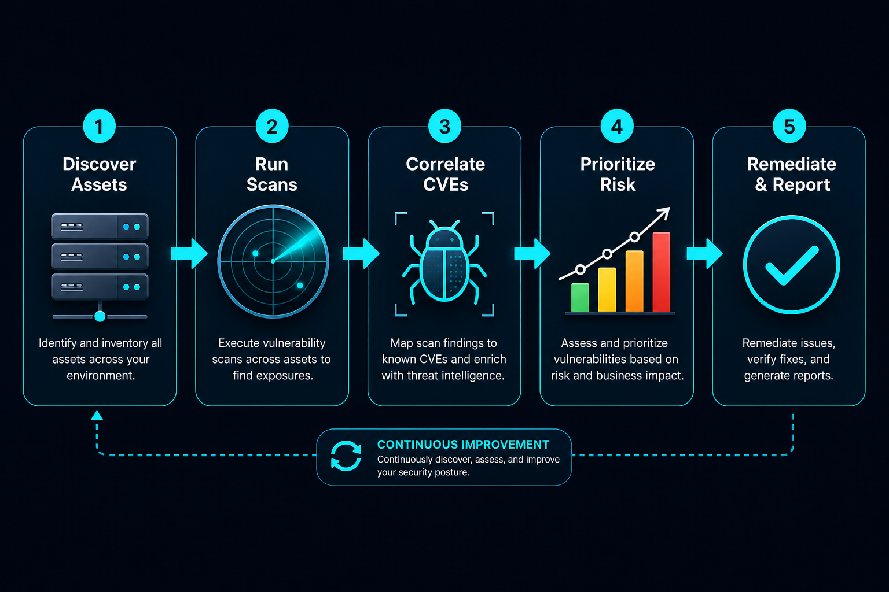
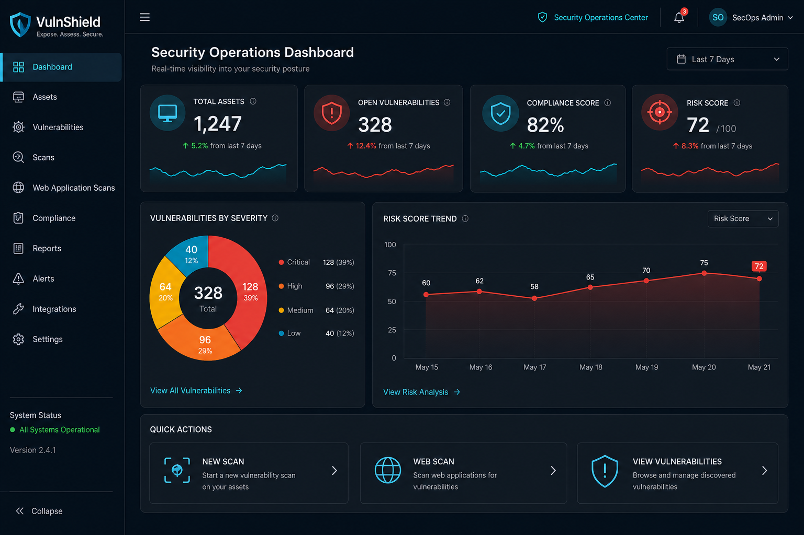
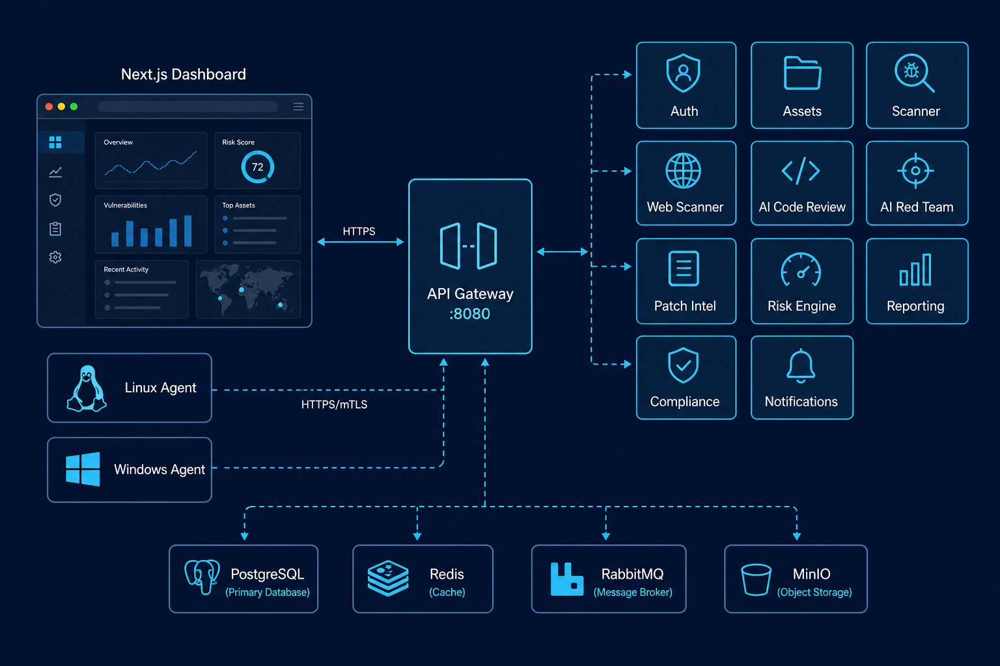

# VulnShield Capabilities Reference

Complete reference of platform modules, operations, and what each action accomplishes.



---

## 1. Asset discovery & inventory

**Purpose:** Maintain an authoritative inventory of every system in scope for vulnerability management.

| Operation | Location | What happens |
|-----------|----------|--------------|
| Agent registration | Admin → Agents | Endpoint agent authenticates with API token and registers hostname, OS, fingerprint |
| Heartbeat | Automatic (agent) | Agent reports online status every 5 minutes; offline assets flagged |
| Inventory collection | Automatic (agent) | Packages, ports, users, services, cron jobs collected on schedule |
| View assets | Assets page | Paginated table with IP, OS, criticality, vuln count, risk score |
| Search assets | Assets page search | Filter by name, IP, hostname, tags |
| Asset detail | Click row | Software inventory, open ports, linked vulnerabilities, compliance results |

**Collectors:**
- **Linux:** dpkg/rpm/apk packages, systemd, kernel modules, security patches
- **Windows:** Registry software, services, scheduled tasks, hotfixes, local users

---

## 2. Vulnerability scanning

**Purpose:** Identify security weaknesses across infrastructure using multiple scan modalities.



| Operation | Location | What happens |
|-----------|----------|--------------|
| **New scan** | Scans → New Scan | Create scan job: name, type (agent/SSH/WinRM/network/web/CIS), optional target asset |
| **Start scan** | Scans → Actions ▶ | Queues and executes scan; findings correlated to CVE database |
| **Cancel scan** | Scans → Actions ■ | Stops a running scan job |
| **View results** | Scans table | Status, findings count, severity breakdown (Critical/High/Medium/Low) |
| **Auto-refresh** | Scans page | Table polls every 3 seconds while scans are active |

**Scan types:**

| Type | Description |
|------|-------------|
| Agent-based | Uses installed endpoint agent for local assessment |
| Agentless (SSH) | Remote Linux assessment via SSH credentials |
| Agentless (WinRM) | Remote Windows assessment via WinRM |
| Network | Port and service discovery across IP ranges |
| Web application | Delegates to DAST scanner for HTTP/HTTPS targets |
| CIS benchmark | Configuration compliance against CIS hardening benchmarks |

---

## 3. Vulnerability management

**Purpose:** Triage, assign, and track remediation of findings across the organization.

| Operation | Location | What happens |
|-----------|----------|--------------|
| **View all vulns** | Vulnerabilities page | Sortable table: title, CVE, asset, CVSS, risk score, status |
| **Search** | Vulnerabilities search | Filter by title, CVE ID, or asset name |
| **Open detail** | Click row | Side drawer with description, remediation steps, CVE metadata |
| **Change status** | Detail drawer → Status | Updates lifecycle: open → acknowledged → assigned → in progress → resolved |

**Severity levels:** Critical, High, Medium, Low, Informational

**Status lifecycle:**
```
open → acknowledged → assigned → in_progress → mitigated → resolved → closed
                                              ↘ risk_accepted
                                              ↘ false_positive
```

---

## 4. Web application scanning (DAST)

**Purpose:** Dynamic testing of web applications for OWASP Top 10 vulnerabilities.

| Operation | Location | What happens |
|-----------|----------|--------------|
| **Start web scan** | Web Scanner → Start Web Scan | Enter target URL; active crawl + security tests execute |
| **View findings** | Web Scanner table | URL, vulnerability type, OWASP category, severity, date found |

**Typical findings:** SQL injection, XSS, missing security headers, insecure cookies, CSRF, path traversal.

---

## 5. AI code review

**Purpose:** Automated security analysis of source code repositories using local LLM.

| Operation | Location | What happens |
|-----------|----------|--------------|
| **New review** | Code Review → New Review | Submit repo URL and language; analysis queued |
| **View results** | Code Review table | Repository, branch, findings count, status, timestamps |

**Security constraint:** Uses **Ollama + Qwen 3.6 locally only**. Source code is never transmitted to cloud LLM providers.

**Output includes:** OWASP mapping, CWE identifiers, severity, and fix recommendations.

---

## 6. AI red team

**Purpose:** Automated adversary simulation to identify attack paths and control gaps.

| Operation | Location | What happens |
|-----------|----------|--------------|
| **New campaign** | Red Team → New Campaign | Define name, description, and scope |
| **View results** | Red Team table | Findings count, status, executive summary on completion |

**Maps to:** MITRE ATT&CK techniques, lateral movement paths, credential exposure.

**Security constraint:** Local Ollama + Qwen 3.6 only.

---

## 7. Patch intelligence

**Purpose:** Connect vulnerabilities to actionable patch and vendor advisory information.

| Operation | Location | What happens |
|-----------|----------|--------------|
| **Patch lookup** | Patch Intelligence page | CVE-to-patch mapping with vendor bulletin links |
| **EOL check** | Per-CVE detail | End-of-life status for affected software versions |
| **Availability** | Patch table | Whether a vendor fix exists and its release date |

---

## 8. Risk engine

**Purpose:** Prioritize remediation using composite risk scoring beyond CVSS alone.

| Operation | Location | What happens |
|-----------|----------|--------------|
| **Asset risk score** | Risk page / Dashboard | Technical risk × business criticality × exposure |
| **Entity scoring** | Risk table | Per-asset and per-vulnerability composite scores |
| **Heatmap** | Executive dashboard | Visual risk distribution across assets and categories |

**Factors:** CVSS v3, EPSS probability, CISA KEV status, asset criticality (1–5), internet exposure, data classification.

---

## 9. Compliance

**Purpose:** Measure security posture against industry frameworks.

| Operation | Location | What happens |
|-----------|----------|--------------|
| **View assessments** | Compliance page | Framework scores with passed/failed control counts |
| **Gap analysis** | Assessment detail | Controls requiring remediation |
| **Trend** | Dashboard chart | Compliance score over time |

**Supported frameworks:** CIS Controls v8, NIST CSF 2.0, NIST 800-53, ISO 27001, PCI-DSS.

---

## 10. Reporting

**Purpose:** Generate stakeholder-ready reports for executives, engineers, and auditors.

| Operation | Location | What happens |
|-----------|----------|--------------|
| **Auto PDF on scan complete** | Scans → Actions → PDF | Executive report with findings, severity breakdown, remediation |
| **Auto PDF on SAST complete** | Code Review → PDF | Repo, file path, or pasted code — OWASP/CWE findings |
| **Auto PDF on red team** | Red Team → PDF | MITRE ATT&CK findings with proof and remediation |
| **DAST PDF** | Web Scanner → Download PDF | OWASP web findings after active scan |
| **Reports library** | Reports page | All executive PDFs with download |

---

## 11. Notifications & alerting

**Purpose:** Push security events to the right teams through their preferred channels.

| Channel | Configuration | Events |
|---------|---------------|--------|
| **Email (SMTP)** | `.env` SMTP_* vars | Critical vulns, scan completion, SLA breaches |
| **Slack** | `SLACK_WEBHOOK_URL` | Real-time SOC alerts |
| **Microsoft Teams** | `TEAMS_WEBHOOK_URL` | Team channel notifications |
| **Webhooks** | Custom URL | SIEM, Jira, ServiceNow integration |

---

## 12. Dashboards

| Dashboard | Audience | Key metrics |
|-----------|----------|-------------|
| **Executive** | Leadership | Risk score, compliance %, open vulns, MTTR, trend charts |
| **SOC** | Analysts | Active scans, critical alerts, resolved this month, heatmap |

**Quick actions (Executive dashboard):**
- New Vulnerability Scan → `/scans`
- Start Web Scan → `/web-scanner`
- View Vulnerabilities → `/vulnerabilities`

---

## 13. Administration & security

| Operation | Location | What happens |
|-----------|----------|--------------|
| **Manage users** | Users page | Create, disable, assign roles |
| **RBAC** | Role definitions | 6 built-in roles with granular permissions |
| **Audit logs** | Audit Logs page | Login, scan, vuln status change, config events |
| **LDAP SSO** | `.env` LDAP_* | Enterprise directory authentication |
| **MFA** | User profile | TOTP authenticator enrollment |
| **Agent tokens** | Settings → Agents | Scoped registration tokens for endpoint agents |

**Roles:**

| Role | Access |
|------|--------|
| administrator | Full access |
| security_manager | Operations + reports + compliance |
| soc_analyst | Triage, scans, dashboard |
| developer | Code review + vulnerability remediation |
| auditor | Read-only compliance and audit |
| read_only | Dashboard and reports only |

---

## Architecture reference



See [ARCHITECTURE.md](ARCHITECTURE.md) for detailed service diagrams and data flows.
