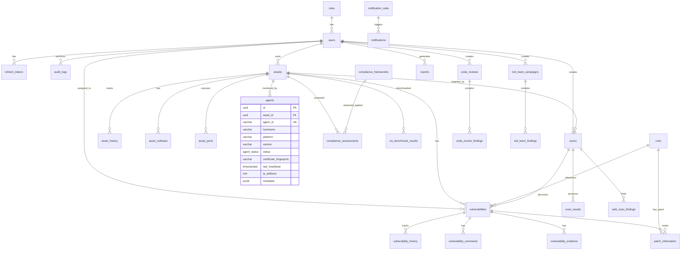
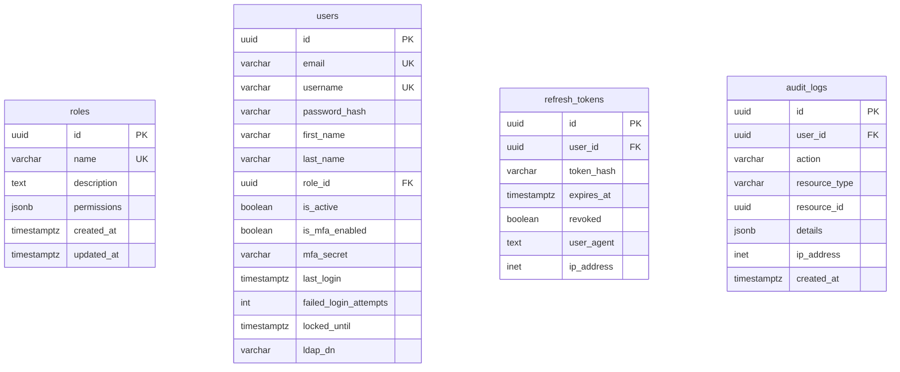
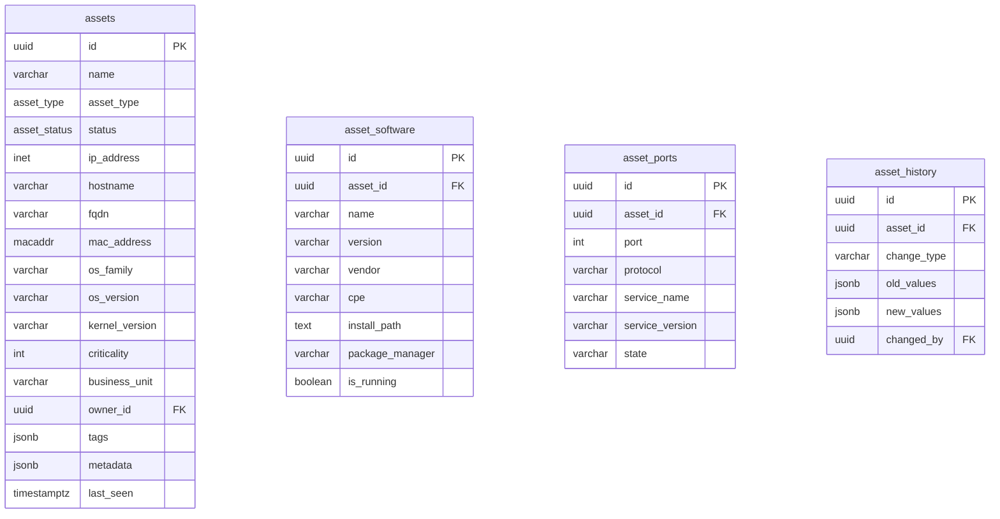
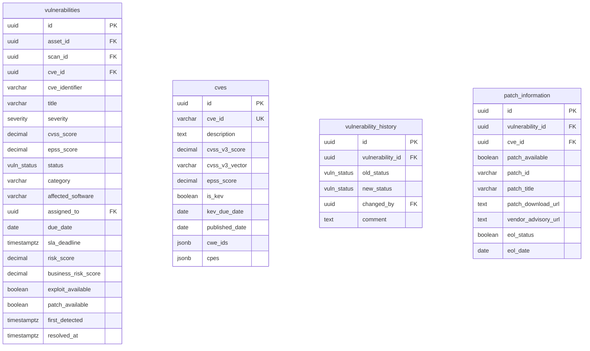
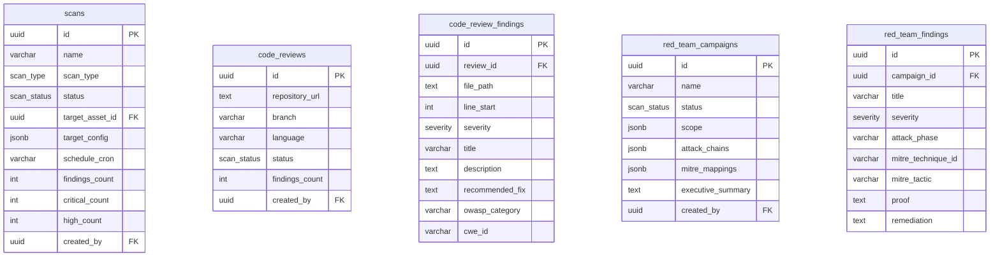

# VulnShield Platform Entity Relationship Diagram

This document describes the PostgreSQL schema used by all VulnShield microservices. The canonical schema is defined in `shared/database/init/001_schema.sql`.

## Core Entity Relationships

## RBAC & Authentication

## Asset Management

## Vulnerability Lifecycle

## Scanning & AI

## Key Enumerations

| Enum | Values |
|------|--------|
| `asset_type` | linux_server, windows_server, docker_container, virtual_machine, cloud_asset, ip_range, domain, web_application, network_device, database |
| `asset_status` | active, inactive, decommissioned, pending_discovery |
| `agent_status` | online, offline, pending, error |
| `scan_type` | agent, agentless_ssh, agentless_winrm, agentless_smb, network, web_app, cis_benchmark, code_review, red_team |
| `scan_status` | queued, running, completed, failed, cancelled, partial |
| `severity` | critical, high, medium, low, info |
| `vuln_status` | open, acknowledged, assigned, in_progress, risk_accepted, mitigated, resolved, closed, reopened, false_positive |
| `report_type` | executive, technical, compliance, patch, risk, trending, asset |
| `notification_channel` | email, slack, teams, webhook |

## Indexes

Performance-critical indexes are defined on:

- `assets(ip_address)`, `assets(hostname)`, `assets(criticality)`
- `vulnerabilities(asset_id)`, `vulnerabilities(severity)`, `vulnerabilities(status)`, `vulnerabilities(cve_identifier)`
- `cves(cve_id)`, `cves(cvss_v3_score DESC)`, `cves(is_kev) WHERE is_kev = TRUE`
- `audit_logs(user_id)`, `audit_logs(action)`, `audit_logs(created_at DESC)`
- `risk_scores(entity_type, entity_id)`
