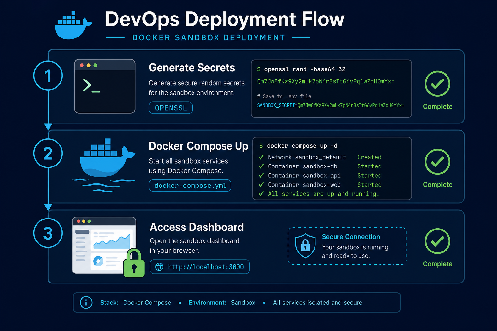

# VulnShield Sandbox Deployment

Hardened deployment for **staging, POC, and isolated security labs**. No hardcoded credentials, no demo data leakage, infrastructure ports kept internal, and scan targets restricted to an allowlist.



## Security guarantees (sandbox)

| Control | Implementation |
|---------|----------------|
| No default admin password | Admin created from `INIT_ADMIN_PASSWORD` env var at first boot |
| Demo/mock mode disabled | `NEXT_PUBLIC_ENABLE_DEMO_MODE=false` (build-time); impossible when `NEXT_PUBLIC_DEPLOY_ENV=production` |
| No demo corp.local seed data | Only RBAC roles + compliance frameworks load at init; run `make seed` for dev sample data only |
| No silent mock chart fallbacks | Dashboard charts stay empty when API returns no data (unless demo mode is on) |
| Secret validation | Services exit on startup if weak/default secrets detected |
| CORS locked down | Explicit `CORS_ORIGINS` required in sandbox |
| Redis auth | `--requirepass` enforced in sandbox |
| No OpenAPI docs | `/docs` disabled in sandbox/production |
| No Prometheus on public net | `/metrics` not mounted in protected environments |
| Ingestion auth | Agent machine tokens (`X-Agent-Token`) — not user JWTs |
| mTLS fail-closed | Agent mTLS bypass disabled in sandbox/production |
| **Scan target allowlist** | `SCAN_SANDBOX_MODE=true` — only localhost, `*.local`, `*.vulnshield-net`, docker-internal hosts; RFC1918 when `SANDBOX_ALLOW_PRIVATE=true` |
| **No external scanning** | `ALLOW_EXTERNAL_TARGETS=false` blocks arbitrary internet targets |
| **No simulated findings** | `ALLOW_SIMULATED_SCANS=false` — web scanner and red team refuse stub/fake output |
| **AI local-only** | `AI_SECURITY_LOCAL_ONLY=true` — Ollama on internal network only (no host port) |
| **Real CVE data** | NVD sync via `make cve-sync` or `CVE_SYNC_ON_STARTUP=true` — no fake corp.local CVEs |
| **Internal infra only** | Postgres, Redis, RabbitMQ, MinIO, Ollama, ZAP, scan-worker have no host port bindings |

## Quick start (Docker Compose)

```bash
# 1. Generate secrets (prints admin password once — save it securely)
./scripts/generate-sandbox-env.sh .env.sandbox

# 2. Start sandbox stack (API + UI on localhost; AI + scan-worker internal)
make sandbox-up

# 3. Open UI — sandbox banner confirms restricted mode
open http://localhost:3002
```

Log in with the admin credentials printed by step 1. You will be prompted to change the password (`must_change_password=true`).

### Optional: sync CVE intelligence

```bash
make cve-sync    # Fetch last 7 days from NVD (limit 500)
```

Set `NVD_API_KEY` in `.env.sandbox` for higher rate limits (optional).

### Optional: provision a Linux agent token

```bash
# After login, issue a scoped machine token (admin JWT required):
curl -X POST http://localhost:18080/api/v1/agents/tokens \
  -H "Authorization: Bearer $ADMIN_JWT" \
  -H "Content-Type: application/json" \
  -d '{"agent_id":"my-host-01","label":"lab-agent"}'

# Run agent with the returned token (shown once):
export AGENT_TOKEN=vsat_...
export VULNSHIELD_API_URL=http://localhost:18080/api/v1
python agents/linux/agent.py
```


## Host ports (Docker Desktop)

Sandbox binds **only two** services to your machine (loopback), so most containers show an empty **PORTS** column in Docker Desktop — that is expected.

| Service | Published port | URL |
|---------|----------------|-----|
| `frontend` | `127.0.0.1:3002` → container `3000` | http://127.0.0.1:3002 |
| `api-gateway` | `127.0.0.1:18080` → container `8080` | http://127.0.0.1:18080/health |

Ports **3000** and **8080** are used by the default (dev) compose file. Sandbox uses **3002** and **18080** to avoid conflicts (for example Open WebUI on 3000). Always start sandbox with `make sandbox-up` (both compose files + `.env.sandbox`), not plain `docker compose up`.

## Scan restrictions

When `SCAN_SANDBOX_MODE=true` and `ALLOW_EXTERNAL_TARGETS=false`:

| Allowed | Blocked |
|---------|---------|
| `localhost`, `127.0.0.1`, `::1` | Public internet hosts (e.g. `example.com`) |
| `*.local` hostnames | Arbitrary external IPs |
| `*.vulnshield-net` docker aliases | Scanning outside your lab without explicit opt-in |
| Docker service names (`postgres`, `zap`, …) | |
| RFC1918 (`10/8`, `172.16/12`, `192.168/16`) when `SANDBOX_ALLOW_PRIVATE=true` | |

The UI displays a **sandbox banner** when `NEXT_PUBLIC_DEPLOY_ENV=sandbox`.

## Kubernetes

```bash
# Never commit real secrets
cp k8s/secrets.example.yaml k8s/secrets.yaml
# Edit k8s/secrets.yaml with openssl-generated values
# Edit k8s/configmap.yaml — set CORS_ORIGINS and NEXT_PUBLIC_API_URL to your ingress URL

kubectl apply -f k8s/namespace.yaml
kubectl apply -f k8s/configmap.yaml
kubectl apply -f k8s/secrets.yaml
kubectl apply -f k8s/
```

Apply `k8s/network-policy.yaml` when your cluster supports NetworkPolicy.

## Local development (optional demo mode)

For UI-only development without a backend:

```bash
cp frontend/.env.local.example frontend/.env.local
# Set NEXT_PUBLIC_ENABLE_DEMO_MODE=true
# Set NEXT_PUBLIC_DEMO_USERNAME and NEXT_PUBLIC_DEMO_PASSWORD
npm run dev
```

**Never** set `NEXT_PUBLIC_ENABLE_DEMO_MODE=true` in sandbox or production builds.

## Pre-deploy checklist

- [ ] All secrets generated with `openssl rand` (not example values)
- [ ] `.env.sandbox` / `k8s/secrets.yaml` not committed to git
- [ ] `ENVIRONMENT=sandbox` set for all services
- [ ] `SCAN_SANDBOX_MODE=true` and `ALLOW_EXTERNAL_TARGETS=false`
- [ ] `ALLOW_SIMULATED_SCANS=false`
- [ ] `CORS_ORIGINS` matches your frontend URL exactly
- [ ] `NEXT_PUBLIC_API_URL` points to public API ingress (not cluster DNS)
- [ ] `NEXT_PUBLIC_ENABLE_DEMO_MODE=false`
- [ ] TLS terminated at ingress / load balancer
- [ ] Postgres/Redis/RabbitMQ/MinIO/Ollama/ZAP not exposed to public internet
- [ ] Agent tokens issued per host (not shared user JWTs)
- [ ] Rotate `INIT_ADMIN_PASSWORD` after first login
- [ ] Run `make migrate` to apply `004_agent_tokens.sql`

## Data isolation

- Sandbox uses dedicated Docker volumes / K8s PVCs
- No production data should be mounted into sandbox
- Fresh Postgres init loads schema + RBAC roles only — **not** fake corp.local assets or vulnerabilities (`make seed` is development-only)
- CVE data comes from NVD API sync, not seeded demo records
- Web scanner uses real engines (nuclei/httpx) when available; simulated stubs are disabled in sandbox
- Red team requires local Ollama — static fallback findings are refused when `ALLOW_SIMULATED_SCANS=false`
- AI features use local Ollama (`make sandbox-up` pulls `qwen3.6` via `ollama-init`) — source code sent to LLM stays in your network
- **`vulnshield-ollama-init` is a one-shot init job** (`restart: "no"` in Compose): it pulls the model and **exits 0**. Docker Desktop showing **Exited** (not Running) is **normal**; verify **`vulnshield-ollama`** is healthy and `docker compose exec ollama ollama list` includes `qwen3.6`.
- Audit logs record actions but never passwords or tokens

## Makefile reference

| Command | Description |
|---------|-------------|
| `make sandbox-env` | Generate `.env.sandbox` with random secrets |
| `make sandbox-up` | Start sandbox with AI + scan-worker profiles and run `ollama-init` |
| `make sandbox-down` | Stop sandbox stack |
| `make cve-sync` | Sync recent CVEs from NVD |
| `make pull-qwen` | Pull `qwen3.6` into running Ollama container |
| `make migrate` | Apply DB migrations including `004_agent_tokens.sql` |
